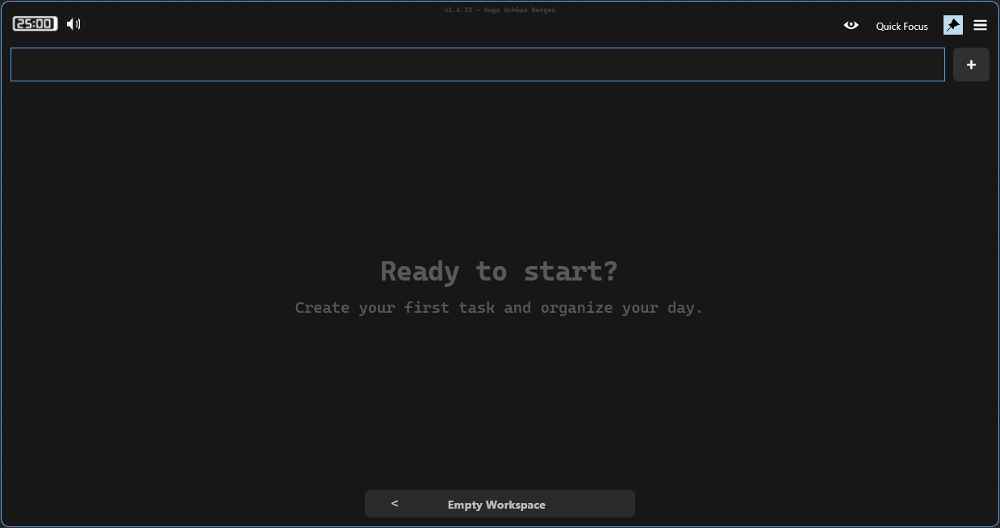
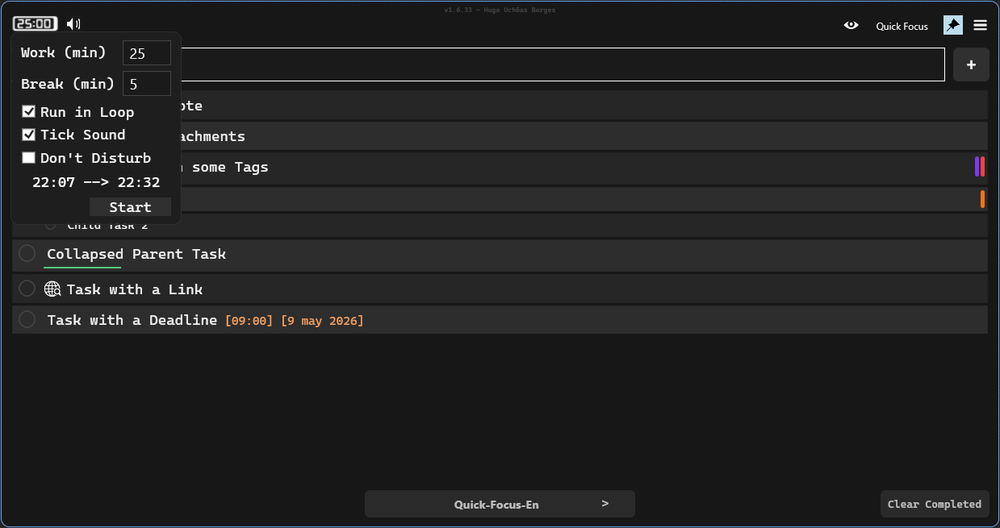
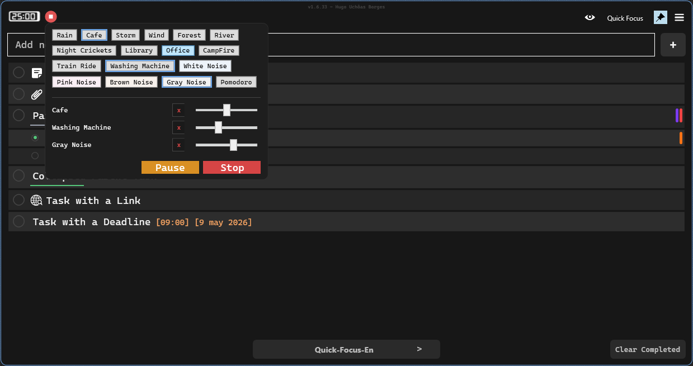

# QuickFocus

  

  <strong>A Windows desktop app built to keep tasks, context, and focus always within reach.</strong>

  <a href="https://github.com/hugouchoasborges/quick-focus-releases/releases/latest/download/QuickFocus-Setup.zip"><strong>Download latest version</strong></a>
  ·
  <a href="https://hugouchoasborges.github.io/quick-focus-releases/">View website</a>
  ·
  <a href="manual.html">Manual</a>

## Productivity Without Context Switching

QuickFocus was created for people who work across multiple projects and need to capture, organize, and resume tasks quickly. It stays available from the Windows tray, opens fast, supports shortcuts, and keeps the essentials close without turning the tool into another distraction.

## What The App Delivers

- **Tasks always within reach:** a tray-first workflow for opening, editing, and moving on without occupying your screen all day.
- **Projects and workspaces:** organize work by context, client, routine, or focus area.
- **Guided focus:** Pomodoro, alarms, snooze, tags, and deadlines help keep momentum.
- **Notes, links, and attachments:** connect important information directly to your tasks.
- **Fast search:** find tasks and context without digging through multiple screens.

## Product Preview

  
  

  
  

## Who It Is For

QuickFocus works well for developers, creators, freelancers, and professionals who move between projects and need to keep next actions, reminders, links, and work notes close.

## Get Started

Download the latest version as a single file:

**[Download QuickFocus for Windows](https://github.com/hugouchoasborges/quick-focus-releases/releases/latest/download/QuickFocus-Setup.zip)**
