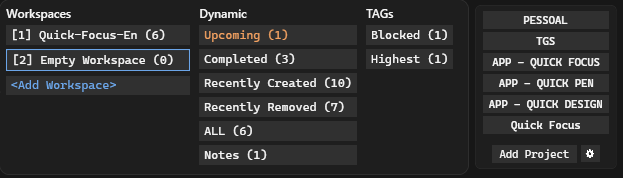
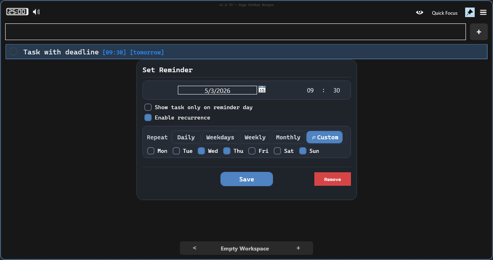
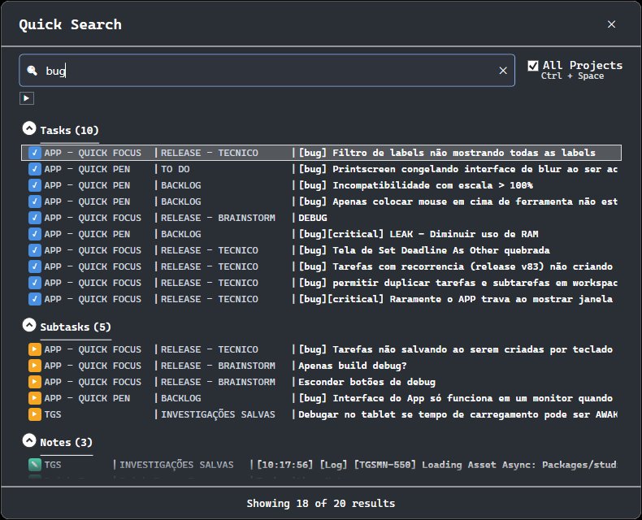
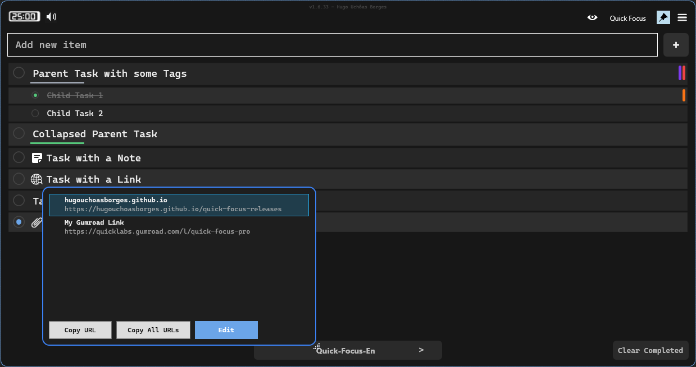
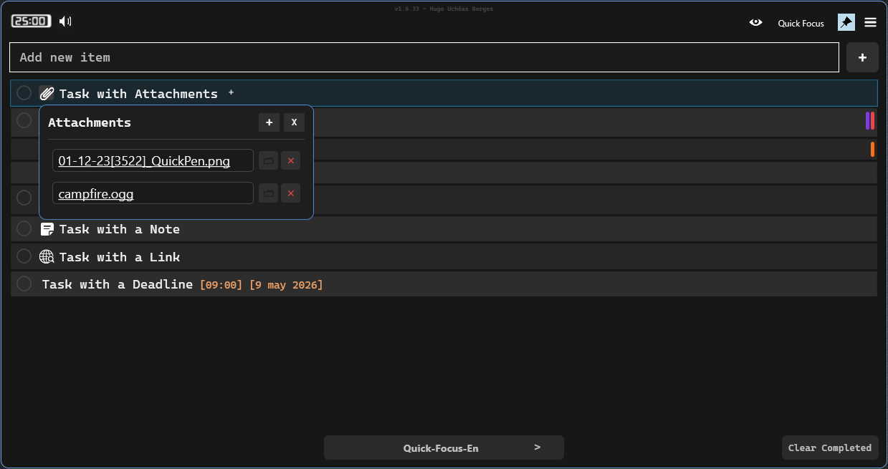
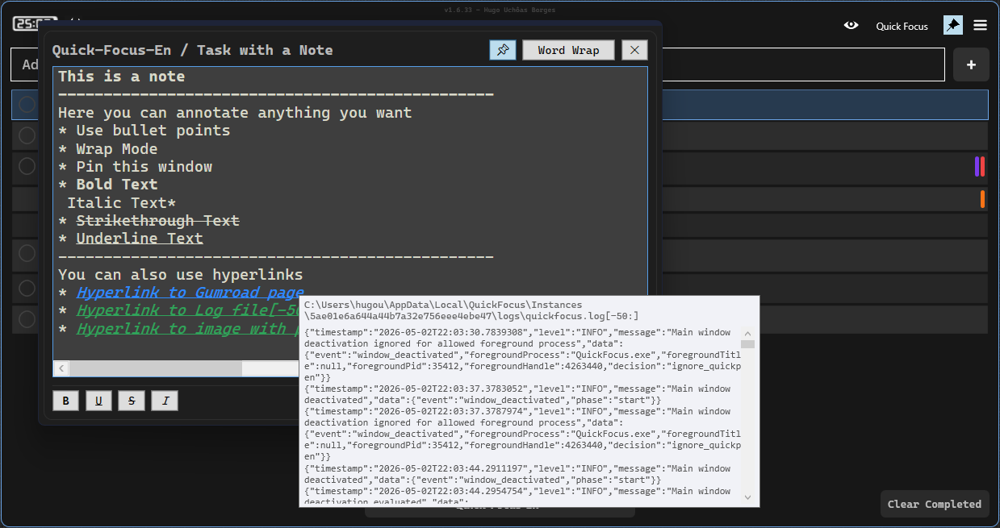
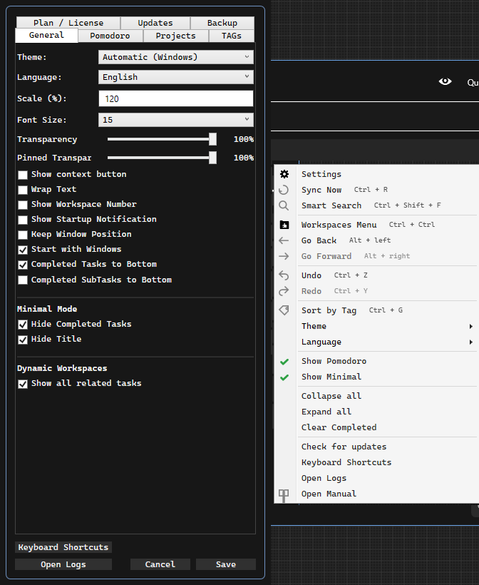
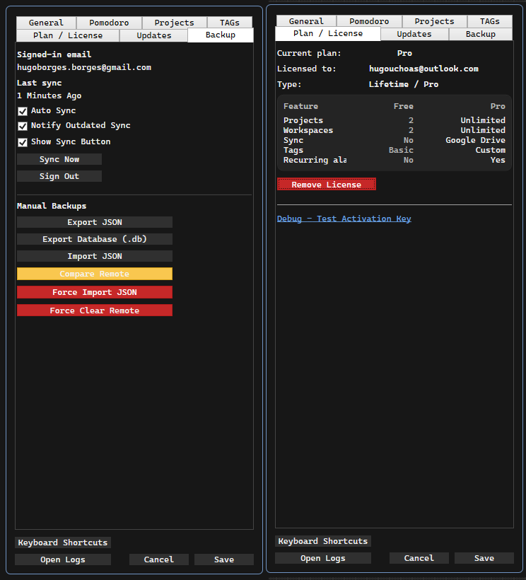

# QuickFocus User Manual

## 1. Overview
QuickFocus is a desktop task manager focused on fast capture, deep organization, reminders, notes, links, and focus sessions.

## 2. Main Interface
### 2.1 Core layout
- Top controls: pin mode, minimal mode, Pomodoro, ambient sounds, and quick actions.
- Main list: tasks and subtasks with status, tags, links, notes, reminders, and attachments.
- Workspace and project navigation: switch context without leaving the main screen.

### 2.2 Task row tools
Each task can expose actions such as:
- Link tools (open/edit links).
- Reminder/deadline editor.
- Notes editor.
- Attachments indicator and popup.
- Context menu with task actions.

## 3. Projects and Workspaces
### 3.1 Multi-project workflow
QuickFocus supports multiple projects. In `Settings > Projects`, you can:
- Add projects.
- Rename projects.
- Move project order up/down.
- Archive/unarchive.
- Delete projects.

Quick project switching shortcuts are available from `F1` to `F12`.

### 3.2 Standard workspaces
Inside each project, you work in standard workspaces for day-to-day planning.

### 3.3 Dynamic workspaces
When dynamic workspaces are enabled, QuickFocus generates special views such as:
- Overdue
- Today
- This Week
- Upcoming
- Completed
- Recently Created
- Recently Removed
- All
- Notes
- Tag-based dynamic workspaces
- Saved-search dynamic workspaces
- Reference dynamic workspaces

`Recently Removed` shows deleted tasks in a recoverable view context (restore/exclude actions require Pro).

### 3.4 Saved searches as workspaces
From active filters, you can save a search as a dynamic workspace (with query, case sensitivity, word-match mode, and selected tags).

## 4. Tasks, Subtasks, and Deadlines
### 4.1 Basic task flow
- Create sibling tasks and subtasks.
- Mark complete/incomplete.
- Duplicate selected tasks.
- Reorder tasks.

### 4.2 Deadline and reminder editor
The reminder screen allows:
- Date selection.
- Optional time.
- "Show only on reminder day" mode.
- Recurrence toggle.

### 4.3 Recurrence modes
Available recurrence modes:
- Daily
- Weekdays
- Weekly
- Monthly
- Custom weekdays (Mon-Sun)

If recurrence is unavailable in your plan, the UI shows it as locked and prompts upgrade.

### 4.4 Reminder popup and Snooze screen
When reminders trigger, the Snooze popup lets you:
- Open task.
- Dismiss.
- Enter target snooze hour/minute.
- Follow reminder queue position when multiple reminders are pending.
- Confirm snooze duration.

Keyboard behavior:
- `Enter`: Snooze
- `Esc`: Dismiss

## 5. Smart Search
Quick Search can search across:
- Tasks
- Subtasks
- URLs
- Notes
- Attachments

It supports:
- Scope toggle: current project or all projects.
- Filter chips and numeric filter shortcuts (`Ctrl + 0` to `Ctrl + 5`).
- Grouped results with direct navigation.

Main shortcut to open Quick Search:
- `Ctrl + Shift + F`

Inside Quick Search:
- `Ctrl + Space`: toggle all-projects mode
- `Enter`: open selected result (closes search)
- `Ctrl + Enter`: open selected result and keep Quick Search open
- `Esc`: close

## 6. Links (Open and Edit Screens)
### 6.1 Link selection screen
If a task has multiple links, the selection screen lets you:
- Open a selected link.
- Copy one link.
- Copy all links.
- Jump to Edit mode.

### 6.2 Link editor screen
The link editor supports:
- Add/update links.
- Optional display text format: `[Display Text] https://...`
- Open link.
- Remove link.
- Copy one/all links.
- Drag-and-drop reorder.
- Double-click and keyboard navigation.

### 6.3 Smart Paste for links and file paths
When pasting into a selected task text field, QuickFocus can detect URL or absolute file path and show Smart Paste choices:
- Add Link (or Add Attachment, depending on content)
- Paste Text

## 7. Attachments
### 7.1 Attachment popup
Attachment management includes:
- Open attachment.
- Open containing folder.
- Remove attachment.
- Remove all attachments.
- Copy attachment files to clipboard.

Shortcut:
- `Ctrl + Shift + A` to open attachment popup for selected task.

### 7.2 Add attachments with Ctrl+V
On selected task text input, `Ctrl + V` supports:
- Pasted file list from clipboard.
- Pasted clipboard image converted to attachment file.

### 7.3 Attachment tooltip previews
Hover tooltips can show:
- Text preview for text-like files (including selector-aware previews).
- Static preview for images.
- Animated GIF/video preview (hover/click behavior).
- File path and missing-file warning when needed.

## 8. Notes
### 8.1 Notes screen
Each task can open a dedicated note window with rich editing and quick actions.

### 8.2 Formatting and search inside notes
Supported inline formatting patterns include:
- `**bold**`
- `*italic*`
- `~~strikethrough~~`
- `__underline__`

Note search tools include:
- Search box
- Next/previous result
- Highlight-all toggle

### 8.3 Hyperlinks in notes
The note context menu supports:
- Create link from clipboard (`Ctrl + K`)
- Open link
- Copy link target
- Edit link target
- Remove link
- Open containing folder (for file links)

Supported link targets:
- URL
- File path
- Folder path

### 8.4 File hyperlinks with preview and line ranges
File links can include line selectors/ranges, for example:
- `file.txt[120]`
- `file.txt[50:80]`
- `file.txt[:120]`
- `file.txt[120:]`
- `file.txt[-30:]`

QuickFocus parses these selectors for preview/open behavior. When possible, opening a file link uses Notepad++ with line targeting.

### 8.5 Paste-driven note link creation
From clipboard content, notes can:
- Parse markdown links and preserve link spans.
- Convert selected text into links using clipboard URL/path.
- Insert link at caret using detected target.

## 9. Pomodoro and Ambient Sound Mixer
### 9.1 Pomodoro
Pomodoro tools include:
- Start/stop session.
- Work and break minute fields.
- Loop mode.
- Tick sound toggle.
- DND during work toggle.
- Work/break completion sound and notification settings.
- Top-bar progress indicator.

### 9.2 Ambient mixer
Ambient mixer supports multiple sounds with per-track controls:
- Add ambient tracks.
- Per-track volume.
- Remove individual tracks.
- Resume / Pause / Stop mixer.

Examples include rain, cafe, storm, wind, forest, river, office/library-like ambiences, and noise variants.

## 10. Settings (All Screens)
### 10.1 General
Main options include:
- Theme (Auto/Light/Dark)
- Language (English/Portuguese)
- Scale and task font size
- Transparency (normal and pinned)
- Startup and layout behavior
- Minimal mode behavior
- Dynamic workspace behavior

### 10.2 Pomodoro tab
- Enable/disable Pomodoro.
- DND during work.
- Ambient sounds enablement.
- Work/break finish sounds and notifications.

### 10.3 Projects tab
Project management UI (add/rename/reorder/archive/unarchive/delete).

### 10.4 TAGs tab
Contains:
- TAG Colors management.
- Auto TAG rules (`input text -> target tag`) with:
  - enable/disable
  - case-sensitive
  - match-word
  - rule order

### 10.5 Plan / License tab
Contains:
- Current plan and license details.
- Free vs Pro comparison rows.
- License key activation/removal.

### 10.6 Version tab
Contains:
- Current version and release date.
- Auto update on startup.
- Alpha/Beta release channels.
- Manual check updates action.

### 10.7 Backup tab
Contains:
- Sign-in and sync controls.
- Auto sync and notifications.
- Sync now, logout, stop active sync.
- Backup export/import and remote maintenance actions.

## 11. Clipboard and Text Workflows
### 11.1 Copy as Text
Shortcut:
- `Ctrl + Shift + C`

Exports selected tasks as text, including note and attachment path context.

### 11.2 New Task From Text
Shortcut:
- `Ctrl + Shift + V`

Creates tasks from clipboard text. This action is blocked while a dynamic workspace is active.

## 12. Minimal Mode and Pin Mode
### 12.1 Minimal Mode
- Compact visual mode for focus.
- Can hide completed tasks and title/top controls depending on settings.

### 12.2 Pin Mode
- Keeps QuickFocus always on top.
- Uses pinned transparency settings.
- Highlighted pinned visual state.

## 13. Keyboard Shortcuts (Core)
| Shortcut | Action |
|---|---|
| `Ctrl + Shift + F` | Open Smart Search |
| `Ctrl + K` | Open task link editor |
| `Ctrl + L` | Open reminder/deadline editor |
| `Ctrl + N` | Open task note |
| `Ctrl + Shift + A` | Open attachments |
| `Ctrl + Shift + C` | Copy as Text |
| `Ctrl + Shift + V` | New Task From Text |
| `Ctrl + 1..9` | Jump to workspace slots |
| `Ctrl + ,` / `Ctrl + .` | Previous/next workspace |
| `F1..F12` | Jump to project slots |
| `Alt + Left` / `Alt + Right` | Back/forward navigation history |
| `Ctrl + M` | Open hamburger menu |
| `Ctrl + Shift + M` | Open task context menu |
| `Ctrl + R` | Sync now |
| `Ctrl + H` | Toggle "Show all related tasks" in dynamic workspaces |

## 14. Free vs Pro Notes
Current Free plan behavior in app code includes:
- Max 2 projects.
- Max 2 custom workspaces.
- Recurring reminders locked.
- Sync-related premium gating.
- Ambient sounds limited to a subset (Rain, Cafe, White Noise, Pomodoro).

## 15. Troubleshooting
- If a file link does not open, confirm the target file still exists and path is absolute.
- If selector-based preview fails, verify selector syntax (for example `[start:end]`).
- If clipboard actions fail, retry after a short delay (clipboard lock can happen on Windows).
- If sync actions are disabled, check plan/license state and sign-in status.

## 16. FAQ
### Is QuickFocus free?
Yes. A Free plan is available with limits.

### How do I unlock Pro?
Use `Settings > Plan / License` and activate your key.

### Does QuickFocus support recurring deadlines?
Yes, with recurrence modes (Daily/Weekdays/Weekly/Monthly/Custom), subject to plan availability.

### Can I preview attachments before opening?
Yes. Tooltips can show text previews and visual previews (image/GIF/video).

