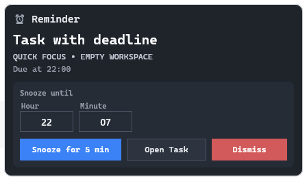
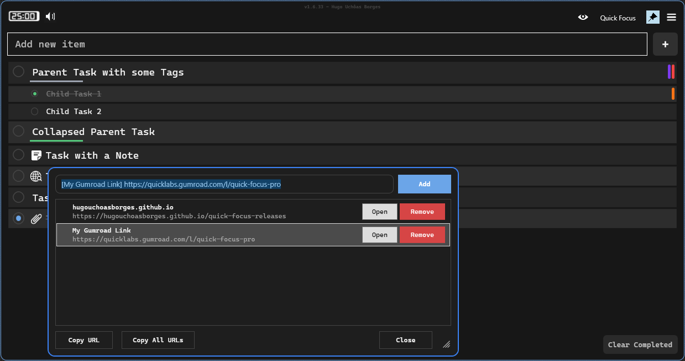
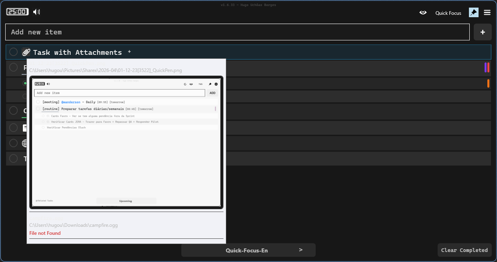
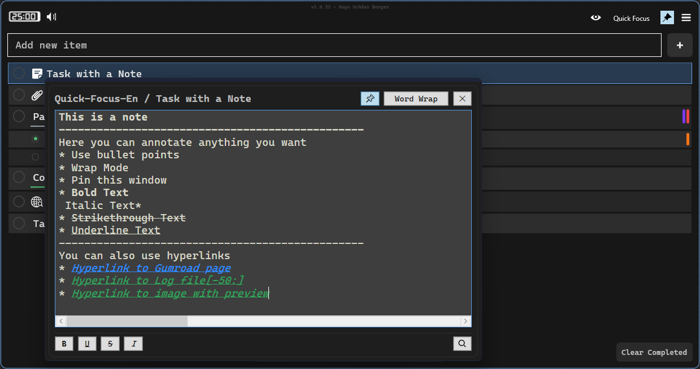

# Manual do Usuário QuickFocus

## 1. Visão Geral
QuickFocus é um app desktop de tarefas focado em captura rápida, organização profunda, lembretes, notas, links e sessões de foco.

## 2. Interface Principal
### 2.1 Estrutura base
- Controles superiores: modo pin, modo minimal, Pomodoro, sons ambientes e ações rápidas.
- Lista principal: tarefas e subtarefas com status, tags, links, notas, lembretes e anexos.
- Navegação por workspace e projeto: troca de contexto sem sair da tela principal.

### 2.2 Ferramentas na linha da tarefa
Cada tarefa pode expor ações como:
- Ferramentas de link (abrir/editar links).
- Editor de lembrete/deadline.
- Editor de notas.
- Indicador de anexos e popup de anexos.
- Menu de contexto com ações da tarefa.

## 3. Projetos e Workspaces
### 3.1 Fluxo multi-projetos
O QuickFocus suporta múltiplos projetos. Em `Settings > Projects`, você pode:
- Adicionar projetos.
- Renomear projetos.
- Mover ordem para cima/baixo.
- Arquivar/desarquivar.
- Excluir projetos.

Atalhos de troca rápida de projeto: `F1` até `F12`.

### 3.2 Workspaces padrão
Dentro de cada projeto, você trabalha em workspaces padrão para o planejamento do dia a dia.

### 3.3 Workspaces dinâmicos
Com workspaces dinâmicos ativados, o QuickFocus gera visões especiais como:
- Vencido
- Hoje
- Esta Semana
- Futuras
- Concluidas
- Criado Recentemente
- Removidas
- TODOS
- Notas
- Workspaces dinâmicos por tag
- Workspaces dinâmicos por busca salva
- Workspaces dinâmicos por referência

`Recently Removed` mostra tarefas excluidas em um contexto recuperavel (acoes de restaurar/remover exigem Pro).

### 3.4 Busca salva como workspace
A partir de filtros ativos, você pode salvar uma busca como workspace dinâmico (com query, modo case sensitive, match por palavra e tags selecionadas).

## 4. Tarefas, Subtarefas e Deadlines
### 4.1 Fluxo básico de tarefas
- Criar tarefas irmãs e subtarefas.
- Marcar como concluída/não concluída.
- Duplicar tarefas selecionadas.
- Reordenar tarefas.

### 4.2 Tela de deadline e lembrete
A tela de lembrete permite:
- Selecionar data.
- Definir hora opcional.
- Modo "mostrar apenas no dia do lembrete".
- Habilitar recorrência.

### 4.3 Modos de recorrência
Modos disponíveis:
- Daily
- Weekdays
- Weekly
- Monthly
- Dias customizados (Mon-Sun)

Se recorrência não estiver disponível no seu plano, a interface mostra bloqueio e oferece upgrade.

### 4.4 Popup de lembrete e tela de Snooze
Quando um lembrete dispara, o popup de Snooze permite:
- Abrir tarefa.
- Dismiss.
- Informar hora/minuto alvo para snooze.
- Acompanhar fila quando houver multiplos lembretes pendentes.
- Confirmar duração do snooze.

Comportamento de teclado:
- `Enter`: Snooze
- `Esc`: Dismiss

## 5. Smart Search
A Quick Search pesquisa em:
- Tasks
- Subtasks
- URLs
- Notas
- Attachments

Ela suporta:
- Escopo: projeto atual ou todos os projetos.
- Chips de filtro e atalhos numericos (`Ctrl + 0` a `Ctrl + 5`).
- Resultado agrupado com navegação direta.

Atalho principal para abrir Quick Search:
- `Ctrl + Shift + F`

Dentro da Quick Search:
- `Ctrl + Space`: alterna modo todos os projetos
- `Enter`: abre o resultado selecionado (fecha a busca)
- `Ctrl + Enter`: abre o resultado e mantem a Quick Search aberta
- `Esc`: fecha

## 6. Links (Telas de Abrir e Editar)
### 6.1 Tela de seleção de links
Se a tarefa tiver múltiplos links, a tela de seleção permite:
- Abrir link selecionado.
- Copiar um link.
- Copiar todos os links.
- Ir para modo de edição.

### 6.2 Tela de edição de links
O editor de links suporta:
- Adicionar/atualizar links.
- Formato opcional de texto de exibição: `[Texto] https://...`
- Abrir link.
- Remover link.
- Copiar um/todos os links.
- Reordenar por drag-and-drop.
- Duplo clique e navegação por teclado.

### 6.3 Smart Paste para links e caminhos de arquivo
Ao colar no campo de texto de uma tarefa selecionada, o QuickFocus detecta URL ou caminho absoluto e mostra opções de Smart Paste:
- Add Link (ou Add Attachment, conforme o conteúdo)
- Paste Text

## 7. Anexos
### 7.1 Tela/popup de anexos
A gestão de anexos inclui:
- Abrir anexo.
- Abrir pasta de origem.
- Remover anexo.
- Remover todos os anexos.
- Copiar arquivos anexados para área de transferência.

Atalho:
- `Ctrl + Shift + A` abre popup de anexos da tarefa selecionada.

### 7.2 Adicionar anexos com Ctrl+V
No input de texto da tarefa selecionada, `Ctrl + V` aceita:
- Lista de arquivos colada da área de transferência.
- Imagem do clipboard convertida em arquivo de anexo.

### 7.3 Tooltips de preview de anexos
Tooltips por hover podem mostrar:
- Preview de texto para arquivos textuais (inclusive com seletor de linhas).
- Preview estático para imagens.
- Preview animado de GIF/vídeo (com comportamento de hover/click).
- Caminho do arquivo e aviso de arquivo ausente quando necessário.

## 8. Notas
### 8.1 Tela de notas
Cada tarefa pode abrir uma janela dedicada de notas com edição rica e ações rápidas.

### 8.2 Formatação e busca dentro da nota
Padrões inline suportados:
- `**negrito**`
- `*itálico*`
- `~~tachado~~`
- `__sublinhado__`

Ferramentas de busca na nota:
- Caixa de busca
- Próximo/anterior
- Toggle de destacar tudo

### 8.3 Hyperlinks na tela de notas
O menu de contexto da nota suporta:
- Criar link a partir do clipboard (`Ctrl + K`)
- Abrir link
- Copiar destino do link
- Editar destino do link
- Remover link
- Abrir pasta de origem (para links de arquivo)

Tipos de destino suportados:
- URL
- Caminho de arquivo
- Caminho de pasta

### 8.4 Hyperlinks para arquivo com preview e range de linhas
Links de arquivo podem incluir seletores de linha/range, por exemplo:
- `arquivo.txt[120]`
- `arquivo.txt[50:80]`
- `arquivo.txt[:120]`
- `arquivo.txt[120:]`
- `arquivo.txt[-30:]`

O QuickFocus interpreta esses seletores para preview/abertura. Quando possível, abre em Notepad++ com linha alvo.

### 8.5 Criação de link por colagem na nota
A partir do clipboard, as notas conseguem:
- Interpretar links em markdown preservando spans de link.
- Transformar texto selecionado em link usando URL/caminho do clipboard.
- Inserir link no cursor com destino detectado.

## 9. Pomodoro e Mixer de Sons
### 9.1 Pomodoro
Recursos de Pomodoro:
- Iniciar/parar sessão.
- Campos de minutos de trabalho e pausa.
- Modo loop.
- Toggle de som de tick.
- Toggle de DND durante trabalho.
- Sons/notificações ao fim de trabalho e pausa.
- Indicador de progresso na barra superior.

### 9.2 Mixer de sons ambientes
O mixer suporta múltiplos sons com controle por faixa:
- Adicionar sons ambientes.
- Volume por faixa.
- Remover faixa individual.
- Resume / Pause / Stop do mixer.

Exemplos incluem rain, cafe, storm, wind, forest, river, ambiências de escritório/biblioteca e variações de noise.

## 10. Configurações (Todas as Telas)
### 10.1 Aba General
Principais opções:
- Tema (Auto/Light/Dark)
- Idioma (English/Portuguese)
- Escala e fonte de tarefa
- Transparência (normal e pinned)
- Comportamento de startup e layout
- Comportamento do modo minimal
- Comportamento de workspaces dinâmicos

### 10.2 Aba Pomodoro
- Habilitar/desabilitar Pomodoro.
- DND durante trabalho.
- Habilitar sons ambientes.
- Sons e notificações de término de trabalho/pausa.

### 10.3 Aba Projects
Tela de gestão de projetos (add/rename/reorder/archive/unarchive/delete).

### 10.4 Aba TAGs
Contém:
- Gestão de TAG Colors.
- Regras de Auto TAG (`texto de entrada -> tag alvo`) com:
  - enable/disable
  - case-sensitive
  - match-word
  - ordem da regra

### 10.5 Aba Plan / License
Contém:
- Plano atual e detalhes de licença.
- Comparativo Free vs Pro.
- Ativação e remoção de license key.

### 10.6 Aba Version
Contém:
- Versão atual e data de release.
- Auto update no startup.
- Canais Alpha/Beta.
- Ação manual de checar updates.

### 10.7 Aba Backup
Contém:
- Controles de login e sync.
- Auto sync e notificações.
- Sync now, logout e stop de sync ativa.
- Ações de export/import de backup e manutenção remota.

## 11. Fluxos de Clipboard e Texto
### 11.1 Copy as Text
Atalho:
- `Ctrl + Shift + C`

Exporta tarefas selecionadas como texto, incluindo contexto de notas e caminhos de anexos.

### 11.2 New Task From Text
Atalho:
- `Ctrl + Shift + V`

Cria tarefas a partir de texto no clipboard. Essa ação fica bloqueada quando um workspace dinâmico está ativo.

## 12. Minimal Mode e Pin Mode
### 12.1 Minimal Mode
- Modo visual compacto para foco.
- Pode ocultar tarefas concluídas e título/controles superiores conforme as configurações.

### 12.2 Pin Mode
- Mantém o QuickFocus sempre no topo.
- Usa transparência específica para estado pinned.
- Estado visual de pin destacado.

## 13. Atalhos de Teclado (Principais)
| Atalho | Ação |
|---|---|
| `Ctrl + Shift + F` | Abrir Smart Search |
| `Ctrl + K` | Abrir editor de links da tarefa |
| `Ctrl + L` | Abrir editor de lembrete/deadline |
| `Ctrl + N` | Abrir nota da tarefa |
| `Ctrl + Shift + A` | Abrir anexos |
| `Ctrl + Shift + C` | Copy as Text |
| `Ctrl + Shift + V` | New Task From Text |
| `Ctrl + 1..9` | Ir para slots de workspace |
| `Ctrl + ,` / `Ctrl + .` | Workspace anterior/proximo |
| `F1..F12` | Ir para slots de projeto |
| `Alt + Left` / `Alt + Right` | Historico de navegacao (voltar/avancar) |
| `Ctrl + M` | Abrir menu hamburger |
| `Ctrl + Shift + M` | Abrir menu de contexto da tarefa |
| `Ctrl + R` | Sincronizar agora |
| `Ctrl + H` | Alternar "Show all related tasks" em workspaces dinamicos |

## 14. Observações de Free vs Pro
Comportamento atual do plano Free no código do app:
- Máximo de 2 projetos.
- Máximo de 2 workspaces customizados.
- Recorrência de lembrete bloqueada.
- Recursos de sync com bloqueio premium.
- Sons ambientes limitados a um subconjunto (Rain, Cafe, White Noise, Pomodoro).

## 15. Solução de Problemas
- Se um link de arquivo não abrir, confirme se o arquivo ainda existe e se o caminho é absoluto.
- Se preview com seletor falhar, valide a sintaxe (por exemplo `[inicio:fim]`).
- Se ações de clipboard falharem, tente novamente após alguns instantes (lock do clipboard no Windows).
- Se ações de sync estiverem desabilitadas, confira estado de plano/licença e login.

## 16. FAQ
### O QuickFocus é gratuito?
Sim. Existe plano Free com limitações.

### Como desbloquear o Pro?
Use `Settings > Plan / License` e ative sua chave.

### O QuickFocus suporta deadline recorrente?
Sim, com modos de recorrência (Daily/Weekdays/Weekly/Monthly/Custom), sujeito à disponibilidade do plano.

### Posso visualizar anexos antes de abrir?
Sim. Tooltips podem exibir preview de texto e preview visual (imagem/GIF/vídeo).

